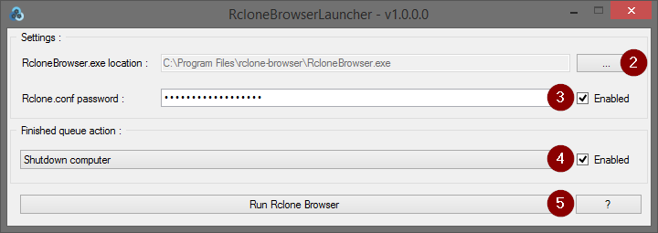
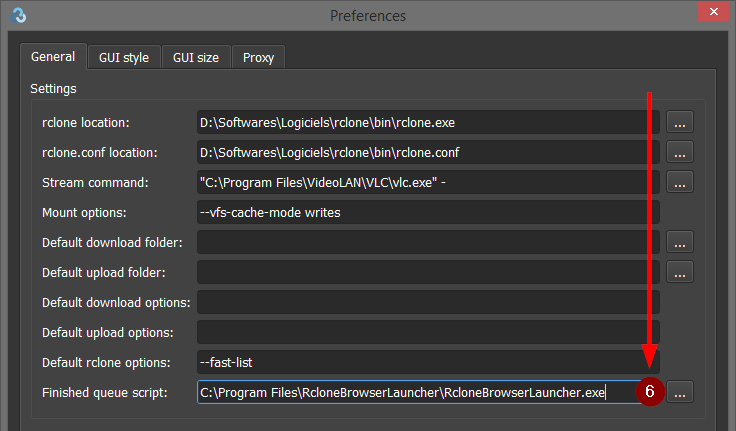
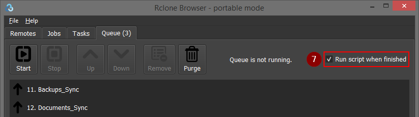

# RcloneBrowserLauncher

## About
Launcher for [Rclone Browser](https://github.com/kapitainsky/RcloneBrowser) allowing you to :
- Start `Rclone Browser` with `RCLONE_CONFIG_PASS` [environment variable](https://rclone.org/docs/#other-environment-variables) set with your `rclone.conf` password
- Shutdown, hibernate, or sleep your computer at the end of a `Rclone Browser` tasks queue

## Usage
1. Download and run [latest release](https://github.com/FoxP/RcloneBrowserLauncher/releases/latest)
2. Select your `RcloneBrowser.exe` location
3. Enter your `rclone.conf` password (**optional**)
4. Select and action to be performed at the end of a `Rclone Browser` tasks queue (**optional**) :
	- Hibernate computer
	- Shutdown computer
	- Sleep computer
5. Click on the `Run Rclone Browser` button

6. Select `RcloneBrowserLauncher.exe` as finishing queue script in `RcloneBrowser`

	- This step need to be done only once
7. Don't forget to check `Run script when finished` option in `Rclone Browser`

## Requirements
- Microsoft [.NET Framework 4](https://www.microsoft.com/en-US/download/details.aspx?id=17851)
- Microsoft Windows Vista or later

## License
RcloneBrowserLauncher is released under the [GNU General Public License v3.0](https://www.gnu.org/licenses/gpl-3.0.fr.html).
